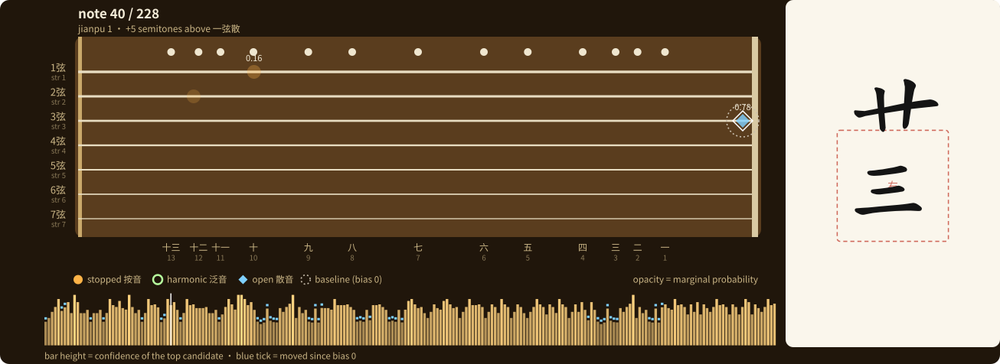

# QinPos

Automatic **string and hui-position assignment for the guqin (古琴)**: input a melody in jianpu (numbered notation), output a playable fingering: which
string, which hui position, and which timbre (散音 open / 按音 stopped / 泛音
harmonic) for every note.

MSc Artificial Intelligence for Media, National Centre for Computer Animation,
Bournemouth University.

## Fingerboard view




## Motivation

Guqin music is written in **jianzipu (減字譜)**, a tablature that records *actions*: press the third string at the seventh hui, but not pitches.
Jianpu records *pitches* but not actions. Turning one into the other is the first stage of 打谱 (dapu), the traditional practice of realising a piece from notation, and it is done by hand by experienced players.

The choice is not obvious: a single pitch can usually be produced on several strings, in three different timbres, so a short phrase has thousands of possible fingerings. Which one an expert picks depends on hand economy, timbre convention, and what comes next.

QinPos automates the pitch-to-position half of that decision. The hui position itself is **physically determined** once a string is chosen (string-length ratios), so the real problem is a structured choice over strings and timbres, which is solved here with a candidate lattice and a linear-chain CRF.

**Out of scope:** left- and right-hand technique (吟猱綽注, 挑抹勾剔 …) is not
predicted. The tablature output leaves those slots empty.

## What's here

```
src/qinpos/       library code (physics, dataset loader, features, decoder, CRF)
scripts/          marimo notebooks: data cleaning, training, evaluation, fingerboard
streamlit_app.py  the interface
data/             GQ39 clone + generated files (not committed)
```

## Data

- **GQ39** — Guqin dataset of 39 annotated pieces, used for training and
  evaluation: https://github.com/yufenhuang/Guqin-dataset
  Huang, Y., Liang, Z., Wei, C. and Su, L. (2020) 'A dataset and a
  transfer-learning approach for guqin transcription', *ISMIR*.

## Third-party work used

- **JianZiPu font / glyphs** — jianzipu character rendering:
  https://github.com/neuralfirings/JianZiPu (SIL Open Font License)

Hui-position ratios were checked against 陳應時《琴律學》(Shanghai Conservatory
of Music Press, 2015).

No pre-trained machine-learning model is used. The CRF and the structured
perceptron are implemented from scratch in pure Python (`src/qinpos/crf.py`,
`src/qinpos/learn.py`).

## Licence

Code: MIT. The GQ39 dataset and the JianZiPu font remain under their own
licences and are not redistributed here.
